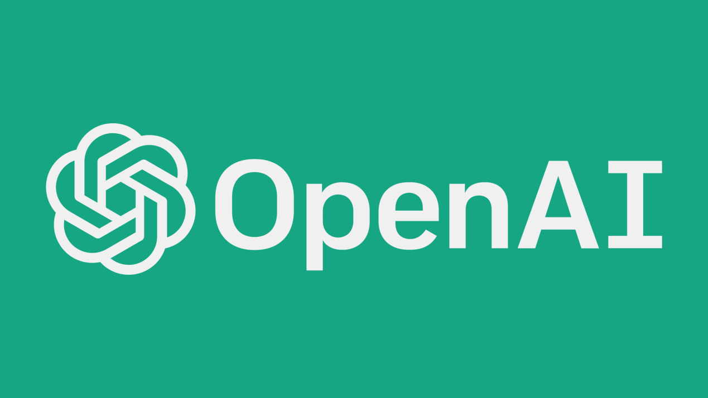

<div align="center">
    
</div>
<br/>

[](LICENSE)


Generate meaningful Git commit messages with AI effortlessly.

## Overview
Quill is an open-source CLI tool that uses artificial intelligence to generate clear, concise, and context-aware Git commit messages. Say goodbye to git commit -m "fix" and let AI do the heavy lifting!

**Quill provides:**
- A command-line interface for generating commit messages.
- Integration with the OpenAI API for AI-powered commit message generation.
- Support for local models via Ollama for private, offline usage.
- Easy-to-use interface for generating commit messages.

<div align="center">
    <h2>OS Compatibility</h2>
</div>

<p align="center">
    
    
    
</p>

<div align="center">
    <h2>LLM Compatibility</h2>
</div>

<p align="center">
    
    
</p>

---

**Commit Message Convention**  
> Quill uses the [Conventional Commits](https://www.conventionalcommits.org/) standard for formatting commit messages.  
> Examples of conventional prefixes:  
> ```
> feat: adds new command for changelog generation
> fix: fixes error handling in commit hook
> chore: updates CI/CD dependencies
> ```
> Check the complete specification at: https://www.conventionalcommits.org/
---

## Build
To build Quill, you'll need to have Go installed on your system.
```bash
go mod tidy
go build -o quill
```

## Quill Configuration
To configure Quill, follow the steps below:

1. **Create a configuration file:**
   Quill uses a `config.yaml` configuration file. You can create a default configuration file in your user directory, or run the command below and let Quill create it for you:
   ```bash
   quill config
   ```
   Whenever you run the `quill config` command, Quill will create a default configuration file in your user directory if the file doesn't exist.
   
   The file path varies according to the operating system:
   - **Linux:** `~/.config/quill/config.yaml`
   - **Windows:** `%APPDATA%/quill/config.yaml`
   - **macOS:** `~/.quill/config.yaml`

   Example of `config.yaml` file content:
   ```yaml
   preferences:
     openai:
       apiKey: "your-api-key-here"
       model: "gpt-4o-mini"
     ollama:
       apiUrl: "http://localhost:11434/api/generate"
       model: "llama3.2"
     providerDefault: "openai"
   ```

2. **Set your credentials:**
   You can set the OpenAI API key and default model using the commands:
   ```bash
   quill config --set-openai-api-key "your-api-key-here"
   quill config --set-openai-model "gpt-4o-mini"
   quill config --set-provider-default "openai"
   ```

Now you're ready to use Quill to generate meaningful commit messages with AI help!
## Usage
1. Stage your changes:
```bash
git add .
```
2. Generate a commit message:
```bash
quill
```
3. Commit your changes:
```bash
git commit -m "your commit message"
```


## Git Hooks
Quill integrates with Git hooks to automatically generate commit messages when you commit your changes.


Create the `.git/hooks/prepare-commit-msg` file with this content:
```sh
#!/bin/sh

generated_message=$(quill)

echo "$generated_message" > "$1"
```
Make it executable:
```bash
chmod +x .git/hooks/prepare-commit-msg
```

Try making a normal `git commit`, the message generated by quill will appear automatically.
